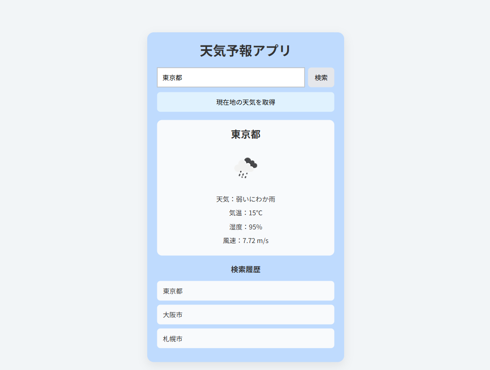
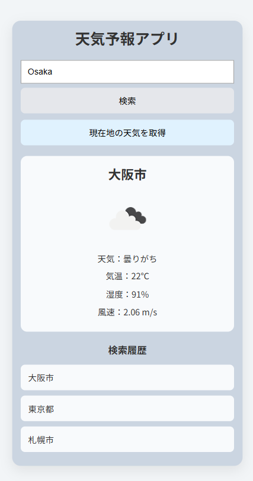

# Weather App

天気情報を検索・表示できるシンプルな天気予報アプリです。  
OpenWeather API を利用して現在の天気情報を取得し、検索履歴機能や現在地取得機能を実装しています。

---

## プロジェクト概要

本アプリケーションは JavaScript を使用した天気予報アプリです。

都市名検索や現在地情報を利用して天気情報を取得し、以下の機能を提供します。

---

## アプリ画面

### PC表示



### モバイル表示



---

## 主な機能

- 都市名検索
- 現在地の天気取得
- 天気アイコン表示
- 気温表示
- 湿度表示
- 風速表示
- 検索履歴表示
- 履歴クリックによる再検索
- 天候による背景色変更
- レスポンシブ対応

---

## 使用技術

- HTML
- CSS
- JavaScript
- Docker
- OpenWeather API

---

## 技術選定理由

### JavaScript

非同期通信（fetch）や API 連携の学習を目的として採用しました。

### Docker

開発環境差異をなくし、同じ環境で開発・実行できるようにするため採用しました。

### OpenWeather API

外部APIを利用したデータ取得および非同期処理の学習を目的として採用しました。

---

## セットアップ方法

### リポジトリをクローン

```bash
git clone https://github.com/shimodum/weather-app.git
```

### プロジェクトへ移動

```bash
cd weather-app
```

### Dockerコンテナ起動

```bash
docker compose up -d
```

### ブラウザアクセス

以下URLへアクセスしてください。

```txt
http://localhost:5500/src/index.html
```

---

## API設定

本アプリケーションでは OpenWeather API を使用しています。

OpenWeather API：

https://openweathermap.org/api

APIキー取得後、`src/js/config.js` を作成し、以下を設定してください。

例：

```javascript
export const API_KEY = "YOUR_API_KEY";
```

`config.js` は Git 管理対象外になっています。

代わりにサンプルファイルを用意しています。

```txt
src/js/config.example.js
```

以下コマンドでコピーしてください。

```bash
cp src/js/config.example.js src/js/config.js
```

※ APIキーは公開リポジトリへアップロードしないよう注意してください。

---

## ディレクトリ構成

```txt
weather-app
├── docker
│
├── src
│   ├── css
│   │   └── style.css
│   │
│   ├── js
│   │   ├── app.js
│   │   ├── weatherApi.js
│   │   ├── cityMap.js
│   │   ├── config.example.js
│   │   └── ui.js
│   │
│   └── index.html
│
├── images
│   ├── pc.png
│   └── mobile.png
│
├── docker-compose.yml
└── README.md
```

※ 処理の中心となる主要ファイルのみ記載しています。

---

## 工夫した点

### UI統一

JavaScript版とReact版でデザイン・レイアウトを統一し、同じ操作感になるよう調整しました。

### レスポンシブ対応

PC・タブレット・スマートフォンでも見やすいレイアウトになるよう対応しました。

### 検索履歴機能

検索履歴を保存し、ワンクリックで再検索できるよう実装しました。

### APIキー管理

APIキーを別ファイルで管理し、Git管理対象から除外しました。

---

## 動作確認項目

以下項目について動作確認を実施しています。

### 都市検索

- Tokyo と入力して天気情報が表示される
- 東京 と入力して天気情報が表示される
- 存在しない都市名入力時にエラーメッセージが表示される
- 空入力時に検索されない

### 現在地取得

- 現在地ボタン押下で現在位置の天気が表示される
- 位置情報拒否時にエラーメッセージが表示される

### 検索履歴

- 検索した都市が履歴に追加される
- 同一都市検索時に重複登録されない
- 最新検索が先頭に表示される
- ページ再読み込み後も履歴が保持される
- 履歴クリックで再検索できる

### UI

- PC表示でレイアウトが崩れない
- タブレット表示でレイアウトが崩れない
- スマートフォン表示で検索ボタンが縦並びになる
- 天候に応じて背景色が変更される
- ボタン無効化状態が正しく反映される

---

## 学習ポイント

本アプリ制作を通じて以下を学習しました。

- fetch を利用した非同期通信
- OpenWeather APIとの連携
- localStorageを利用したデータ保持
- レスポンシブデザイン
- Docker環境での開発
- UI設計およびファイル分割

---

## 今後の改善点

- 5日間天気予報の追加
- ローディングアニメーション追加
- お気に入り都市登録機能
- 地図連携
- TypeScript化
- エラーハンドリング強化

---

## 補足

OpenWeather API の仕様により、入力した都市名と表示される都市名が異なる場合があります。

例：

|入力値|表示結果|
|--|--|
|仙台|仙台|
|仙台市|Sendai|
|Sendai|仙台|

APIレスポンス結果をそのまま表示しているため、表記が統一されない場合があります。